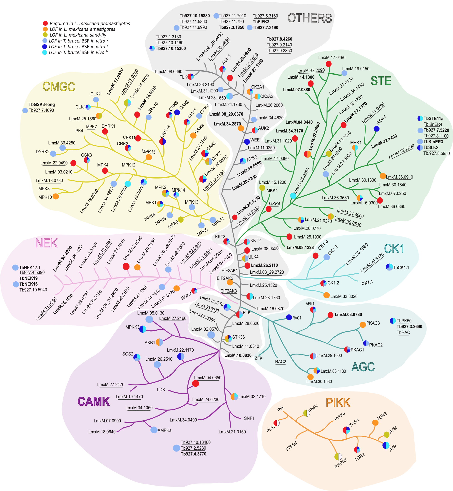
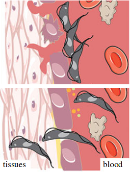

## Current projects:

In eukaryotes, protein kinases and kinase enzyme complexes create protein phosphorylations. These reversible regulatory modifications are essential to control autophagy and promote cell survival and differentiation. Autophagy (from greek “auto” self and “phagos” eating) is an essential process by which cells target cellular components or pathogens to the lysosome for degradation and recycling. Autophagy machinery is also shared with the unconventional secretory pathway, called lysosome exocytosis, that is a fundamental mechanism for the release of proteins that lysosomes could not degrade, thus avoiding potential toxic effect for the cell. Additionally, lysosome exocytosis has been implicated in the breach of host cellular membrane to allow invasion by the worm *C. elegans* through the release of peptidases. 

Kinetoplastids are exquisitely sensitive to their environment and require autophagy to adapt to drastic changes during host transitions. Our laboratory uses *T. brucei* as an excellent tractable model to explore the diversity of eukaryotic signalling networks and to investigate the regulatory mechanisms of autophagy-related pathways and their role for the parasite life-cycle and virulence.

#### Which pathways controlled by protein kinases or kinases complexes regulate autophagy in *T. brucei*?

Notably, *T. brucei* lacks or is independent from essential protein kinase complexes regulating autophagy in classical eukaryotic models. Therefore, studying how protein kinases regulate autophagy and lysosome exocytosis by phosphorylation events is essential to understand how insect-transmitted parasites invade and survive in both mammalian hosts, including humans, and insect-vectors. 

{: .box-figure}
{: .mx-auto.d-block :}
We want to identify what protein kinases regulate autophagy-related pathways during _T. brucei_ differentiation. From Cayla et al., Trends in Parasitology, 2022.

#### What are the roles of autophagy-related pathways in the parasite life-cycle and host adaptation ?

The release of peptidases to the extracellular environment is an essential process by which *T. brucei* is able to sense its population density within the mammalian bloodstream. Indeed, the peptidases digest host proteins and generate oligopeptides that are in turn sensed by the parasites to initiate a quorum-sensing dependent differentiation. This differentiation is not only essential for the progression to the next life stage but also prolongs the survival of the host, both facilitating transmission. However, the mechanisms involved in the release of the peptidases to generate the quorum sensing response remains unknown. An attractive potential pathway for the release of these peptidases, and therefore to enable quorum-sensing and tissue invasion, is the lysosome exocytosis pathway.

{: .box-figure}
{: .mx-auto.d-block :}
Revealing the drivers of differentiation and quorum-sensing initiation in _T. brucei_ is fundamental to understand the parasite host adaptation and survival.

#### How does *T. brucei* invade host-tissues ?

African trypanosomiasis is characterised by initial waves of parasitaemia in the bloodstream, followed by invasion of the central nervous system. Recent studies highlighted the importance of tissues and organs as a potential reservoir and protective environment for the creation of the characteristic waves of parasitaemia, drug resistance and parasite transmission. However, little is known about the dynamic flux between tissues, their roles for the bloodstream re-invasion and their influence on the parasites’ life cycle. With this question, we want to understand how peptidase secretion through autophagy-related pathways enable host tissue invasion by *T. brucei*. This research will provide an understanding of the parasite’s life cycle and disease progression where compartments may play a role. 

{: .box-figure}
{: .mx-auto.d-block :}
We aim to understand what is the role of the release of peptidase by autophagy-related pathways for the dynamic of host tissues invasion by _T. brucei_. Adapted from Silva Pereira et al, Open Biol., 2019.

These researches will not only provide a better understanding of how kinetoplastid parasites adapt to the different hosts encountered during their complex lifecycles and persist *in vivo*, but will lay the foundations for the use of *T. brucei* as model to study the regulation of, and crosstalk between, the autophagy and exocytosis pathways.

## [Past projects](../pastprojects)

 

